group | source | license | tested | readme | preview
:- | :- | :- | :- | :- | :-
image | [FotoKilof](//github.com/TeaM-TL/FotoKilof) |  |  | [.md](_readme/fotokilof.md) | 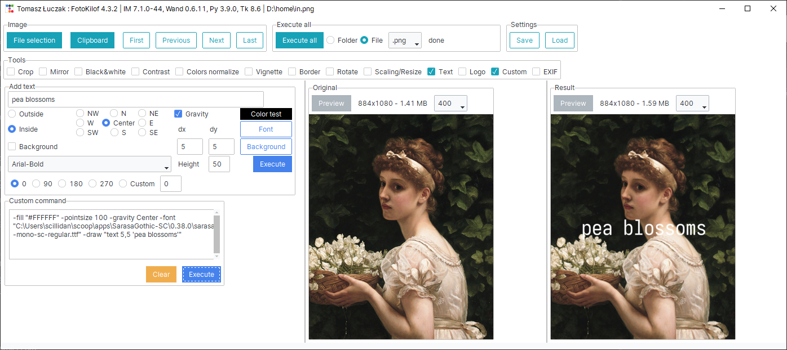
image | [imagepy](//github.com/Image-Pyimagepy/imagepy) |  |  | [.md](_readme/imagepy.md) | 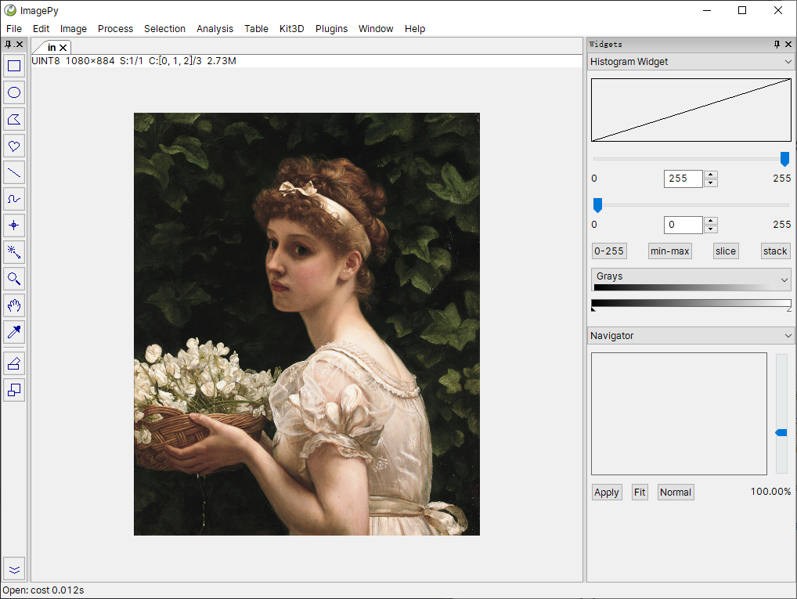
image,node | [chaiNNer](//github.com/chaiNNer-org/chaiNNer) |  |  | [.md](_readme/chainner.md) | 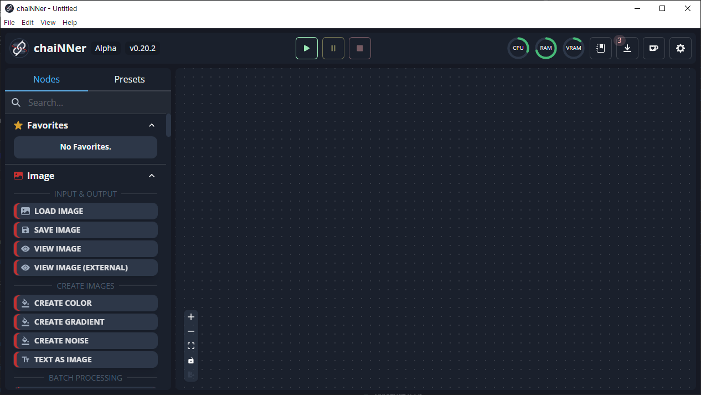
document | [DocumentCorrector](//github.com/Robomarchello/DocumentCorrector) |  |  | [.md](_readme/documentcorrector.md) | 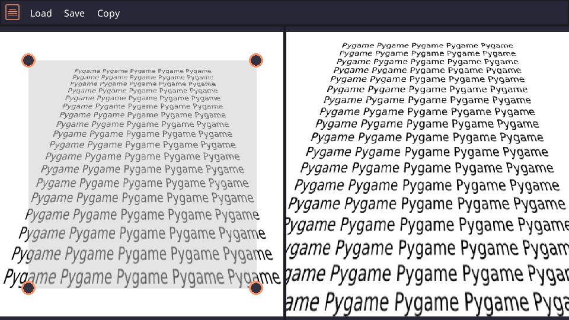
mkv | [MKV Muxing Batch GUI](//github.com/yaser01/mkv-muxing-batch-gui) |  |  | [.md](_readme/mkv-muxing-batch-gui.md) | 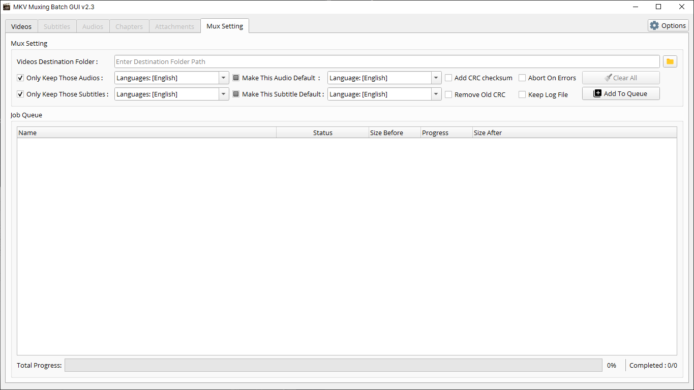
music | [pLACaudio](//github.com/fzao/pLACaudio) |  |  | [.md](_readme/placaudio.md) | 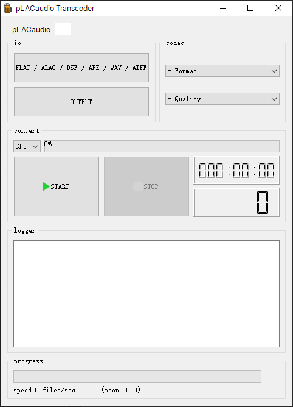
nsz | [NSZ](//github.com/nicoboss/nsz) |  |  | [.md](_readme/nsz.md) | 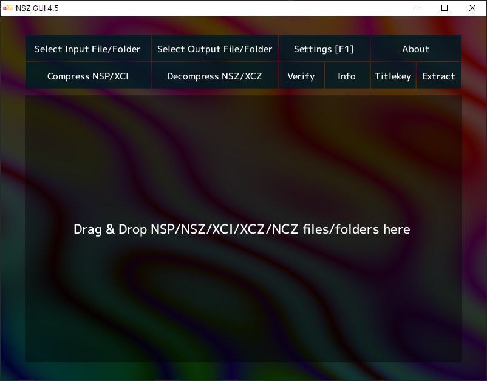
base64 | [PySimpleGUI-Base64-Encoder](//github.com/PySimpleGUI/PySimpleGUI-Base64-Encoder) |  |  | [.md](_readme/pysimplegui-base64-encoder.md) | 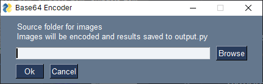
template | [comic-template-maker](//github.com/binarynonsense/comic-template-maker) |  |  | [.md](_readme/comic-template-maker.md) | 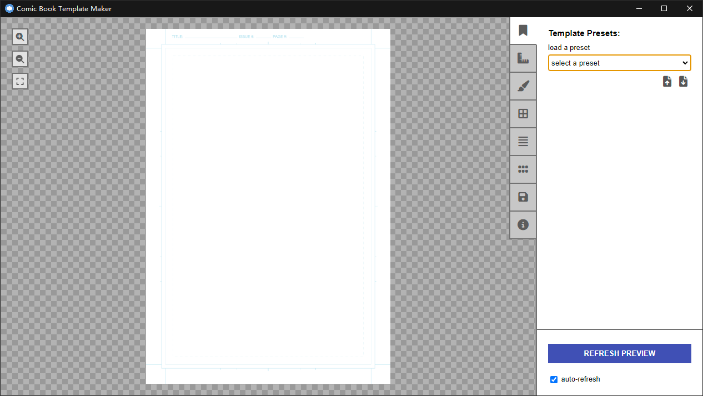
pdf | [pyPDFeditor-GUI](//github.com/Augus1999/pyPDFeditor-GUI) |  |  | [.md](_readme/pypdfeditor-gui.md) | 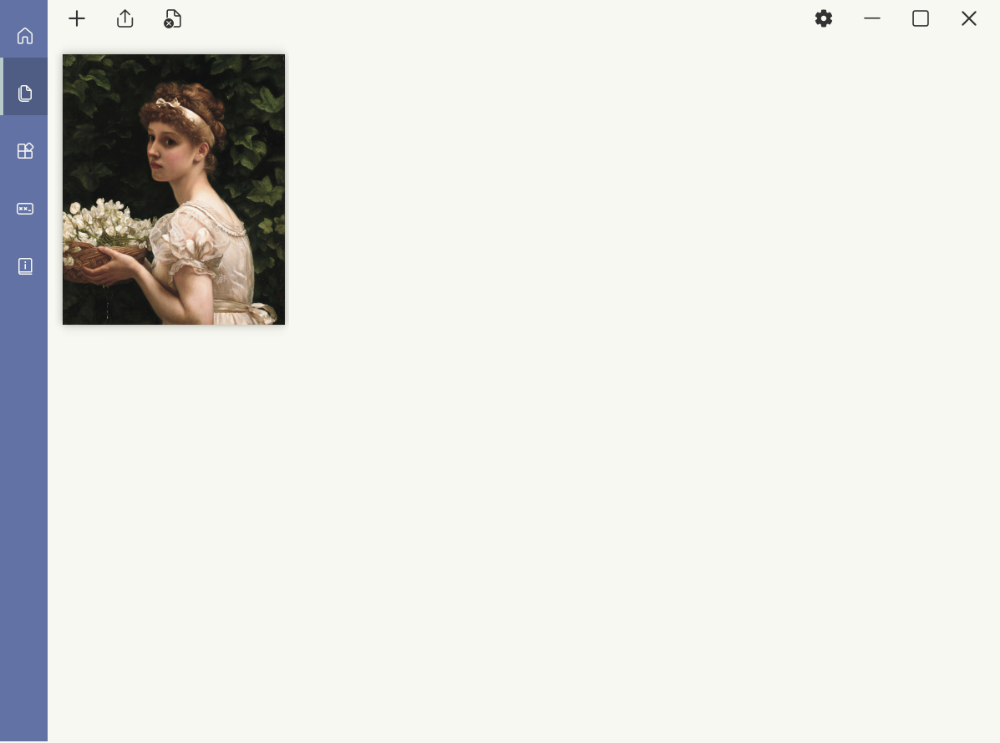
pdf | [PDFsam](//github.com/torakiki/pdfsam) |  | \ | [.md](_readme/pdfsam.md) | 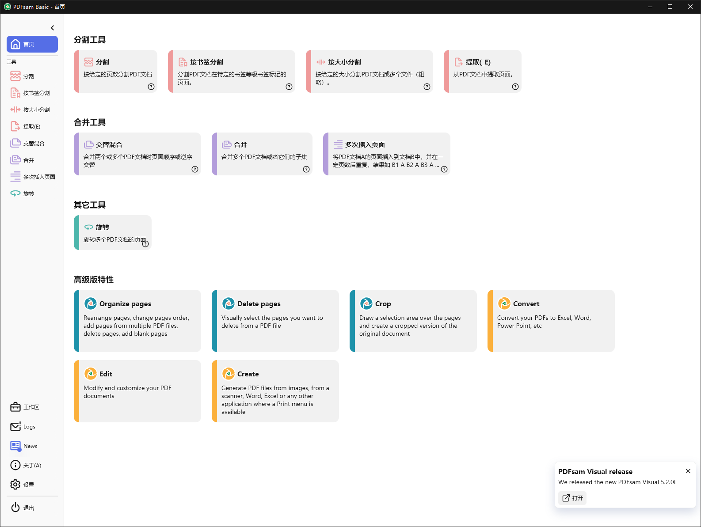